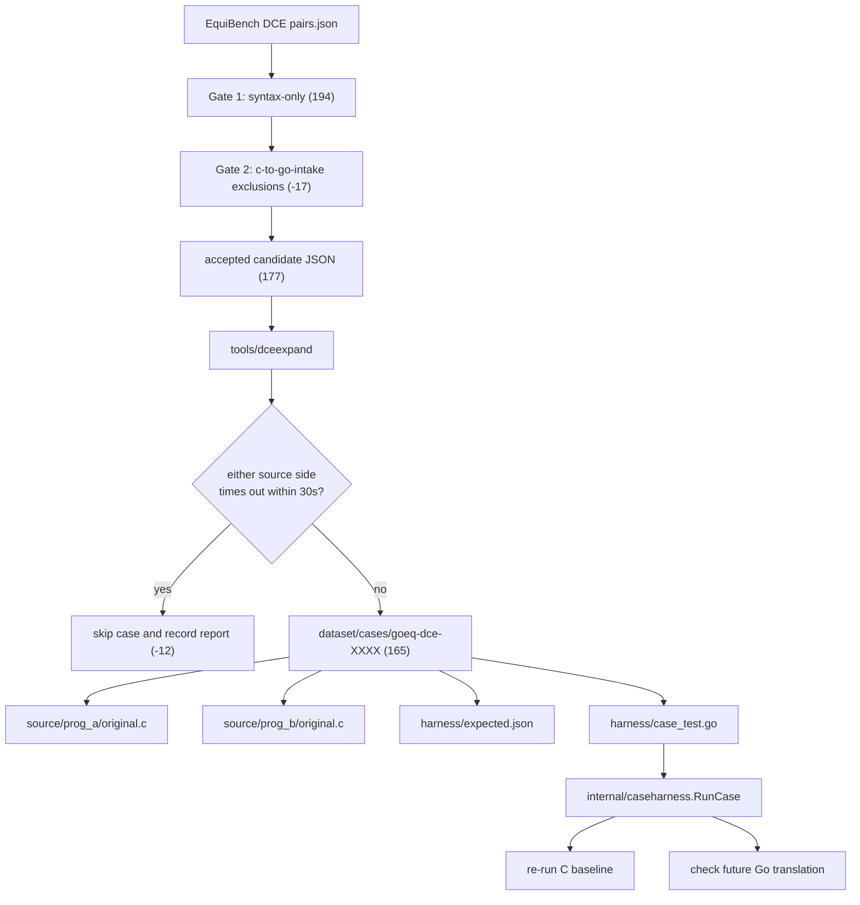

# DCE Filtering Pipeline

This document explains how the repository currently turns `EquiBench` DCE pairs into the published `gobench-eq` C-to-Go intake set.

## Goal

The immediate goal is not full C-to-Go translation. The current goal is to:

1. start from the EquiBench C dataset,
2. keep only the C pairs that fit the current Go translation subset,
3. remove translator-hostile C patterns that the current repository pipeline does not yet support,
4. remove candidates whose source baselines are timeout-dominated under the repository execution bound,
5. materialize each retained pair into a stable case directory,
6. capture source-program baselines so future Go translations can be checked against them.

## Current Input

The current source dataset is:

- `testdata/EquiBench/data/DCE/pairs.json`

Each JSON element is a pair record with:

- a `pair_id`
- the original C code for `program_1` and `program_2`
- the original EquiBench `truth_label`
- source paths and problem metadata

In this repository, DCE is the first imported C category because it is the concrete EquiBench slice we already downloaded and inspected.

## Current Selection Policy

The repository now distinguishes:

- the wider historical `syntax-only` screen
- the current published `c-to-go-intake` profile

The published `c-to-go-intake` uses three explicit gates:

1. `syntax-only` syntax screening
2. translator-subset exclusion screening
3. `30s` source-baseline completion screening

### Gate 1: `syntax-only`

Its rule is intentionally narrow:

- reject pairs if either side uses `union`
- reject pairs if either side uses bitfields
- do not reject on program size
- do not reject on `volatile`
- do not reject on pointer-to-pointer
- do not reject on `goto`
- do not reject on function pointers

This means the first gate is not a "simple programs only" filter. It is a "reject only the C syntax that the current Go mapping does not want to support yet" filter.

### Gate 2: translator-subset exclusions

The second gate removes syntax-compatible pairs that still fall outside the current C-to-Go lowering subset.

The current exclusion families are:

- `pair.unsupported_bool_int_relational`
- `pair.unsupported_mixed_width_relational`
- `pair.unsupported_mixed_width_arithmetic`
- `pair.unsupported_nested_expression_statement_lowering`
- `pair.unsupported_expression_statement_conversion`
- `pair.unsupported_pointer_assignment_or_comparison_lowering`
- `pair.unsupported_signed_unsigned_relational`

These exclusions do not mean Go cannot express those semantics in principle. They mean the current repository translation pipeline does not yet support them with enough stability for benchmark publication. For the current paper-facing intake, those cases are excluded rather than silently retained.

### Gate 3: timeout pruning

The third gate excludes any `c-to-go-intake` candidate where either source program times out under the repository default execution bound of `30s` per process.

Why this gate exists:

- DCE programs are Csmith-derived
- Csmith generates random C programs
- random C programs can be extremely slow or non-terminating under concrete initial states
- timeout-dominated cases are poor correctness oracles for C-to-Go translation because evaluation becomes dominated by timeout matching rather than output or state equivalence

For the current paper-facing intake, those cases are excluded from the published set.

## Pipeline Overview



## Step 1: Run The Current Intake Filter

Command:

```bash
go run ./tools/dcefilter \
  -input testdata/EquiBench/data/DCE/pairs.json \
  -profile c-to-go-intake \
  -report-out /tmp/gobench-eq-dce-filter-report.json \
  -accepted-out /tmp/gobench-eq-dce-accepted.json
```

The filter does five things:

1. load `pairs.json` into `pairRecord` values,
2. analyze both programs in every pair,
3. decide whether the pair is accepted,
4. compute a non-normative complexity score,
5. write a human-readable report plus an accepted-candidate JSON file.

### What `analyzeProgram` extracts

`tools/dcefilter/filter.go` uses regular expressions and simple counters to extract:

- line count
- character count
- function count
- `if`, `for`, `while` counts
- array-bracket count
- `volatile`, `struct`, `union`, `goto` counts
- whether bitfields appear
- whether function pointers appear
- whether pointer-to-pointer patterns appear
- whether `#include "csmith.h"` appears

The analyzer is intentionally shallow. It is a screening pass, not a full C parser.

### How intake acceptance is decided

For each pair:

1. analyze `program_1`
2. analyze `program_2`
3. collect rejection reasons for each side
4. accept the pair only if the reason list is empty

Under `c-to-go-intake`, possible reasons are:

- `program_1.has_union`
- `program_2.has_union`
- `program_1.has_bitfield`
- `program_2.has_bitfield`
- one of the current pair-level translator-subset reasons listed above

### What the score means

The score is computed by `complexityScore`.

It is a heuristic ordering key, not a benchmark label. Lower scores are useful when you want to start translation from easier-looking cases first.

The score currently adds together:

- total lines
- function count with weight `25`
- `volatile` count with weight `12`
- `if` count with weight `6`
- `for` count with weight `4`
- array count with weight `1`
- `struct` count with weight `10`

### Historical Baseline: `syntax-only`

If you want the wider historical screen for comparison, run:

```bash
go run ./tools/dcefilter \
  -input testdata/EquiBench/data/DCE/pairs.json \
  -profile syntax-only \
  -report-out /tmp/gobench-eq-dce-syntax-only-report.json \
  -accepted-out /tmp/gobench-eq-dce-syntax-only-accepted.json
```

That command produces the `194`-pair syntax-compatible superset used as the paper baseline for the later translator-subset exclusions.

## Step 2: Materialize Accepted Pairs And Prune Timeout Cases

Command:

```bash
go run ./tools/dceexpand \
  -input /tmp/gobench-eq-dce-accepted.json \
  -output-root dataset/cases \
  -runtime-root dataset/runtime/csmith \
  -report-out docs/data/dce-materialization-report.json \
  -drop-stale
```

`tools/dceexpand` takes the accepted-candidate JSON and does two things at once:

1. capture the source baseline for every candidate entering the current intake
2. exclude candidates where either source side times out within `30s`

The timeout exclusion is enabled by default through `-exclude-timeouts=true`.

For each accepted pair it:

1. compiles and runs both source C programs with the vendored Csmith runtime
2. if either side times out within `30s`, records the skip in the materialization report and does not publish the case under `dataset/cases/`
3. if both sides finish, creates `dataset/cases/goeq-dce-XXXX/`
4. writes the original C source files into `source/prog_a/original.c` and `source/prog_b/original.c`
5. writes the resulting baseline to `harness/expected.json`
6. writes a per-case `harness/case_test.go`
7. writes placeholder `prog_a/README.md` and `prog_b/README.md`
8. writes `manifest.yaml`
9. writes `notes.md`

When `-drop-stale` is set, old generated case directories that were not materialized in the current run are removed from `dataset/cases/`. This is how the repository removes timeout cases from a previously wider materialized set.

## Step 3: Capture Source Baselines

Baseline capture uses `internal/caseharness.CaptureSourceBaseline`.

For each source program, the harness:

1. finds `clang` or `gcc`,
2. compiles the C file with `-std=c11 -w -lm`,
3. includes `dataset/runtime/csmith`,
4. runs the compiled binary with a `30s` timeout,
5. records:
   - `stdout`
   - `stderr`
   - `exit_code`
   - `timed_out`

Timeout is part of the observation model, but timeout-dominated DCE cases are not retained in the current published draft set. If a candidate times out during baseline capture, it is recorded in the materialization report and excluded from `dataset/cases/`.

## Step 4: Validate Retained Cases

Generated case tests are intentionally opt-in.

Default:

```bash
go test ./...
```

This confirms the hand-written repository code compiles and the generated harness packages are structurally valid, but it does not run every case.

For generated translation packages under `dataset/cases/`, the repository currently treats `go build` plus harness validation as the automatic gate. In practice, the recommended package-level command is:

```bash
go test -vet=off ./dataset/cases/...
```

Why `-vet=off` is the current default for generated case packages:

- some Csmith-derived source programs contain redundant truthiness expressions such as `(x || x)`
- the current C-to-Go lowering keeps those source-level semantics, which can produce Go expressions like `x != 0 || x != 0`
- those generated expressions are buildable and semantically aligned with the source baseline
- but `go test` runs `go vet` by default, and `vet` reports them as `redundant or`

The repository currently does not treat those `vet` findings as benchmark-invalidating on generated case packages. They are treated as generator cleanliness issues, not as correctness failures.

To run an individual retained case:

```bash
GOBENCHEQ_RUN_CASES=1 go test -vet=off ./dataset/cases/goeq-dce-0002/harness
```

To run all retained case harnesses:

```bash
GOBENCHEQ_RUN_CASES=1 go test -vet=off ./dataset/cases/...
```

When `GOBENCHEQ_RUN_CASES=1` is set, `internal/caseharness.RunCase`:

1. rebuilds and reruns `source/prog_a/original.c`
2. rebuilds and reruns `source/prog_b/original.c`
3. checks they still match `harness/expected.json`
4. if `prog_a/` or `prog_b/` contains Go files, runs `go run .`
5. checks the Go program against the baseline of its corresponding C source

Within a single case harness, these sub-checks are allowed to run in parallel through Go subtests. The effective concurrency is then controlled by the usual `go test` flags such as `-p` and `-parallel`.

## How To Judge Whether A Case Is Equivalent

For retained draft C-derived cases, the repository currently uses:

- the imported EquiBench label in `manifest.yaml`
- the declared observable set in `manifest.yaml`
- the captured source baseline in `harness/expected.json`

The practical rule for the current published draft set is:

1. the pair-level label comes from EquiBench for now,
2. only pairs that pass `c-to-go-intake` and the non-timeout gate are retained,
3. each retained side's source baseline defines what a correct Go translation must reproduce,
4. the benchmark should never assume a translated Go program is correct just because the translator produced it.

For example, `goeq-dce-0002` is currently treated as `equivalent` because:

- `manifest.yaml` says `label: equivalent`
- both C programs currently produce the same observable results under the declared harness

## Historical Profiles

The code still contains three non-identical profiles:

- `c-to-go-intake`
- `syntax-only`
- `conservative`
- `balanced`

They are useful for comparison or debugging, but `c-to-go-intake` is the repository default now. `syntax-only` is kept as the wider historical baseline because it cleanly separates "C syntax not supported at all" from "C syntax accepted, but still outside the current published translation subset."
